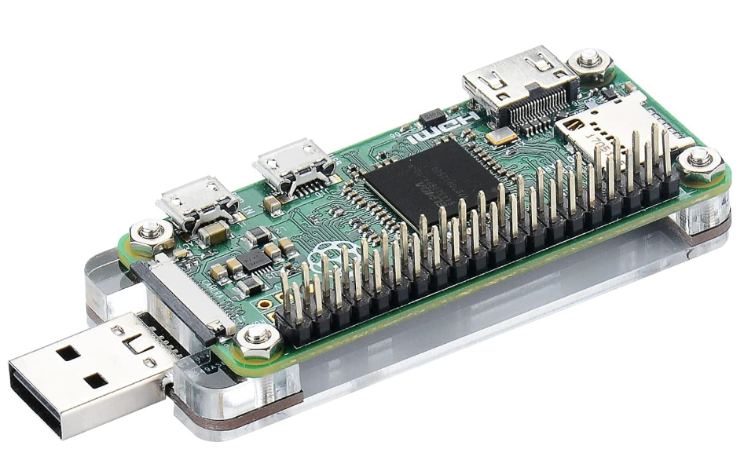

# Goal
This project is intended to show how a pi zero can be used to create a usb stick for simplifying the bara-metal provisioning using cloud init tech. 

# BOM
The project was build using 
- a raspberry pi w 2w  (https://www.raspberrypi.com/products/raspberry-pi-zero-2-w/)
- usb hat (https://a.co/d/6fPu3LR)

